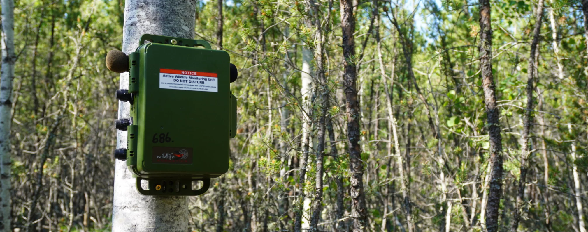
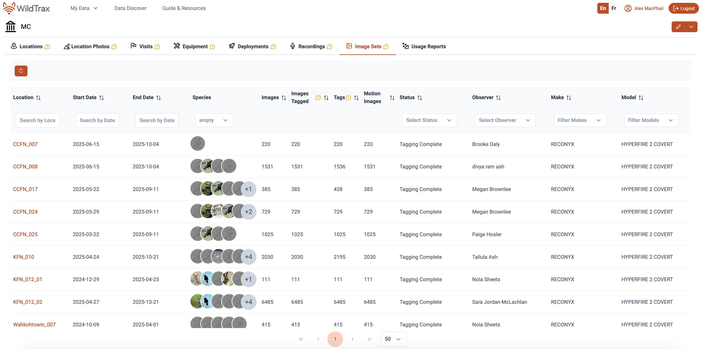

```{r}
#| label: load-packages and authenticate
#| include: true
#| echo: false
#| eval: true
#| warning: false
#| message: false

library(dplyr)
library(tidyr)
library(purrr)
library(lubridate)
library(stringr)
library(tibble)
library(ggplot2)
library(leaflet)
library(wildrtrax)
library(sf)
library(ggridges)
library(kableExtra)
library(plotly)
library(DT)
library(vegan)
library(ggrepel)

wt_auth()

load('mushkegowuk.RData')
#save.image('mushkegowuk.RData')
```

# Abstract

In 2024, the Mushkegowuk Council launched a community-based wildlife monitoring program.This project involves working with Mushkegowuk Nations and using trail cameras (movement triggered cameras) and audio recorders (Song Meter Mini 2) to collect information about the presence, movements and habitat of mammals, birds, and frogs within the Mushkegowuk Territory. Additionally increase capacity for members of Mushkegowuk Nations to engage in monitoring activities. This project provides an opportunity to begin developing capacity amongst community members to combine scientific methods and Indigenous knowledge in the collection and production of baseline information. This report summarizes the key findings from the pilot phase of the initiative and provides recommendations to guide future monitoring efforts.

::: {.callout-note collapse="true" style="background-color: #f4f4f4; padding: 20px;"}
This report is dynamically generated, meaning its results may evolve with the addition of new data or further analyses. For the most recent updates, refer to the publication date and feel free to reach out to the authors.
:::

```{r Data download}
#| warning: false
#| message: false
#| echo: false
#| eval: false
#| include: false
#| code-fold: true

# Download data from WildTrax
mc_aru <- wt_get_projects("ARU") |>
  filter(grepl("Mushkegowuk", project)) |>
  pull(project_id) |>
  wt_download_report('ARU', 'main') |>
  bind_rows() |>
  mutate(year = year(recording_date_time))

mc_cam <- wt_get_projects("CAM") |>
  filter(grepl("Mushkegowuk", project)) |>
  pull(project_id) |>
  wt_download_report('CAM', 'main') |>
  bind_rows() |>
  mutate(year = year(image_date_time))

mc_locs <- wt_get_view("organization_locations", organization = 5843) |>
  mutate(nation = case_when(grepl("CCFN", locationName) ~ "Chapleau Cree First Nation",
                            grepl("KFN",  locationName) ~ "Kashechewan First Nation",
                            grepl("FAFN", locationName) ~ "Fort Albany First Nation",
                            grepl("Wahkohtowin", locationName) ~ "Wahkohtowin",
                            TRUE ~ NA_character_)) |>
  mutate(sensors = case_when(recordingCount > 0 & imageCount > 0 ~ "ARU + CAM", 
                             recordingCount > 0 ~ "ARU", 
                             imageCount > 0 ~ "CAM", 
                             TRUE ~ NA_character_))

```

# Introduction

ARUs and trail cameras are compact environmental sensors that are designed to passively record the environment. ARUs (@aru-overview) capture vocalizing species like birds and amphibians, whereas cameras are mainly designed to detect medium to large-sized animals. The use of these sensors for environmental monitoring is growing in use across the globe (@lots-of-pam) as this technology enables resource managers to conduct prolonged surveys with minimal human interference. The subsequent data collected by these units contribute valuable information to metrics that can be used to aid decision-making and management. Given the rapid and ease of accumulating data from these units, maintaining a high standard of data integrity is paramount to ensure future data interoperability and sharing.

The report summarizes the data collected from the ARUs and trail cameras deployed by Mushkegowuk Nations and their community members with the support ofMushkegowuk Council in 2024-2025. To enhance accessibility and reproducibility, the findings will be presented in this online report with fully documented code, allowing future updates as data collection methods become standardized. Additionally, recommendations will be developed to refine data transcription priorities, improve annual reporting methods, and evaluate recommendations for long-term monitoring. The objectives of this report are to:

-   Document and standardize the data management and processing procedures for acoustic data collected to ensure consistency and reproducibility.
-   Provide a comprehensive report detailing all detected species and the abundance of individuals within the surveyed area.
-   Facilitate the publication of data, making it accessible to the community, public, resource managers, academic institutions, and other relevant agencies to promote transparency and collaboration.
-   Use evaluation results to establish robust metrics that can inform long-term monitoring and conservation strategies.

# Methods

## Data collection

A total of `r length(unique(mc_locs$locationName))` were surveyed in 2025 (@fig-monitoring-locations). The list of locations surveyed and the type of sensors placed at each location is also summarized in @tbl-locations.

```{r}
#| warning: false
#| echo: false
#| eval: true
#| message: false
#| include: true
#| collapse: true
#| code-fold: true
#| fig-align: center
#| fig-width: 8
#| fig-cap: Locations from Mushkegowuk Council
#| label: fig-monitoring-locations

mc_locs_sf <- mc_locs |>
  select(locationName, latitude, longitude, nation, sensors, recordingCount, imageCount) |>
  distinct() |>
  drop_na(latitude) |>
  sf::st_as_sf(coords = c("longitude","latitude"), crs = 4326)

pal <- colorFactor(
  palette  = c("#1f78b4", "#33a02c", "#e31a1c" , "purple"),
  levels   = c("Chapleau Cree First Nation", "Kashechewan First Nation", "Fort Albany First Nation", "Wahkohtowin"),
  domain   = mc_locs_sf$nation,
  na.color = "gray"
)

m <- leaflet(mc_locs_sf) %>%
  addTiles() %>%
  addCircleMarkers(
    popup = ~paste0(
      "<b>Location:</b> ", locationName, "<br>",
      "<b>Nation:</b> ", nation, "<br>",
      "<b>Sensors:</b> ", sensors
    ),
    fillColor   = ~pal(nation),
    color       = "black",
    fillOpacity = 1,
    radius      = 6
  ) %>%
  addLegend(
    pal      = pal,
    values   = ~nation,
    title    = "Nation",
    na.label = "Unknown"
  ) %>%
  addMeasure(primaryLengthUnit = "meters", primaryAreaUnit = "sqmeters") %>%
  addMiniMap(position = "bottomleft")

if (knitr::is_html_output()) {
  m
} else {
  map_file <- "map_aru_locations.png"
  if (!file.exists(map_file)) mapview::mapshot2(m, file = map_file)
  knitr::include_graphics(map_file)
}

```

```{r}
#| warning: false
#| echo: false
#| eval: true
#| message: false
#| include: true
#| label: tbl-locations
#| collapse: true
#| tbl-cap: Locations surveyed, sensors deployed and total data collected.
  
datatable(mc_locs_sf |> mutate(
    latitude  = sf::st_coordinates(geometry)[, 2],
    longitude = sf::st_coordinates(geometry)[, 1]
  ) |>
  sf::st_drop_geometry(), 
          options = list(
            searching = TRUE,  
            paging = TRUE,    
            pageLength = 10   
          ))
```

```{r}
#| warning: false
#| echo: false
#| eval: false
#| message: false
#| include: true
#| collapse: true

mc_recs <- wt_get_view("organization_recordings", organization = 5843)
```


```{r}
#| warning: false
#| echo: false
#| eval: true
#| message: false
#| include: true
#| collapse: true

aru_spp <- mc_aru |>
  group_by(location, species_code) |>
  tally()

he_detect <- mc_recs |>
  select(locationName, recordingDate, hawkEarSpeciesIds) |>
  mutate(recordingDate = as.POSIXct(recordingDate, format = "%Y-%m-%dT%H:%M:%S")) |>
  unnest_longer(hawkEarSpeciesIds) |>
  inner_join(wt_get_species() |> select(species_id, species_code), by = c("hawkEarSpeciesIds" = "species_id")) |>
  select(locationName, species_code) |> 
  distinct()

he_only <- he_detect %>%
  # make sure column names match for joining
  rename(location = locationName) %>%
  anti_join(aru_spp, by = c("location", "species_code")) |>
  left_join(project_spp, by = "species_code") |>
  filter(!included == FALSE)

project_spp <- wt_get_project_species(3919)

```

## Data processing

[WildTrax](https://www.wildtrax.ca) is an online platform developed by the [Alberta Biodiversity Monitoring Institute (**ABMI**)](https://abmi.ca) for users of environmental sensors to help address big data challenges by providing solutions to standardize, harmonize, and share data. The platform supports data collected from autonomous recording units (ARUs) and camera traps, two of the most widely deployed remote sensing technologies in wildlife monitoring. ARUs passively record acoustic data and are particularly effective for detecting birds and other vocalizing species across large spatial extents, while camera traps provide photographic records of wildlife activity at fixed locations. WildTrax provides an end-to-end workflow for environmental sensor data, from upload and storage through to processing, species tagging, and data publication. A key feature of the platform is its standardized tagging protocol, which allows observers to assign species identifications, individual counts, and behavioural annotations to recordings and images. This standardization enables data collected across different organizations, regions, and time periods to be integrated and compared, which is a critical requirement for large-scale biodiversity monitoring programs.

Data processed through WildTrax can be accessed and downloaded via the platform's public data portal or through the [wildRtrax R package](https://abbiodiversity.github.io/wildrtrax/), which provides programmatic access to WildTrax data for downstream analysis. The wildRtrax package facilitates reproducible workflows by allowing users to query, filter, and format WildTrax data directly within R.

### Acoustic data

Recordings were uploaded to for processing and can be downloaded from the platform's Recordings tab in the Organization.



::: {.callout-note collapse="true" style="background-color: #f4f4f4; padding: 20px;"}
Advanced users can also use `wildrtrax` with `wt_get_sync(api = "organization_recordings", organization = 5843)`. Ensure you have correct access to the Organization as these projects are not currently published `r Sys.Date()`.
:::

The principal goal for data processing was to describe the acoustic community of species heard at locations while choosing a large enough subset of recordings for analyses. To ensure balanced replication, we randomly selected 8 recordings per location. Four were processed for 3-minutes between the hours of 3:00 AM - 7:59 AM (dawn period) and four between 20:00 - 23:59 PM (dusk period), ideally on four separate dates. Each of the selections were also chosen on days that did not have any inclement weather (heavy rain or wind), which would be unfavourable for bird surveys. Four samples ensures that there is a minimum number of samples being able to detect most species. Tags are made using count-removal (@farnsworth2002removal, @time-removal) where tags are only made at the time of first detection of each individual heard on the recordings. Amphibian abundance was estimated at the time of first detection using the [North American Amphibian Monitoring Program](https://www.usgs.gov/centers/eesc/science/north-american-amphibian-monitoring-program) with abundance of species being estimated on the scale of “calling intensity index” (CI) of 1 - 3. Mammals such as Red Squirrel, were also noted on the recordings. We also verified that all tags that were created were checked by a second observer to ensure accuracy of detections (@tbl-verified and @tbl-cam-verified). In addition to human transcription, we also ensured that species were not missed at the location level using additional information from HawkEars (@huus2025hawkears), a North American multi-species acoustic classifier, at the task level to avoid false negatives, or missed detections by the tagger. After the data are processed in WildTrax, the wildrtrax package is used to download the data into a standard format prepared for analysis. The wt_download_report function downloads the data directly to a R framework for easy manipulation(see [wildrtrax APIs](https://abbiodiversity.github.io/wildrtrax/articles/apis.html)).

```{r}
#| warning: false
#| echo: false
#| eval: true
#| message: false
#| include: true
#| label: tbl-verified
#| collapse: true
#| tbl-cap: Summary of acoustic verified tags

all_tags <- mc_aru |>
  tally() |>
  pull()

verified_tags <- mc_aru |>
  group_by(tag_is_verified) |>
  tally() |>
  ungroup() |>
  mutate(Proportion = round(n / all_tags,4)*100) |>
  rename("Count" = n) |>
  rename("Tag is verified" = tag_is_verified)

datatable(verified_tags, 
          options = list(
            searching = TRUE,  
            paging = TRUE,    
            pageLength = 10   
          ))

```

### Camera data

Ten camera deployments were tagged by seven different observers using the WildTrax platform. Prior to manual tagging, MegaDetector (@beery2023megadetector) was run on the deployments to auto-tag images with humans, vehicles, and false detections. Bounding boxes were also placed around suspected detections. Detections of animals were tagged for species, and mammal detections received additional tags for count, age, and sex where identification was possible. In addition to animal species, observers manually tagged images with humans, vehicles, and false detections that MegaDetector failed to tag. Tags of mammal species were independently verified by two separate observers who did not participate in initial tagging. Count, age, and sex tags were also verified along with species, and detections tagged as “Unidentified” were verified in case species could be determined. Tags such as human or vehicle, were not verified. Following species verification, tags were quality checked for typos and logical inconsistencies.

```{r}
#| warning: false
#| echo: false
#| eval: true
#| message: false
#| include: true
#| label: tbl-cam-verified
#| collapse: true
#| tbl-cap: Summary of image verified tags

all_cam_tags <- mc_cam |>
  tally() |>
  pull()

verified_cam_tags <- mc_cam |>
  group_by(tag_is_verified) |>
  tally() |>
  ungroup() |>
  mutate(Proportion = round(n / all_cam_tags,4)*100) |>
  rename("Count" = n) |>
  rename("Tag is verified" = tag_is_verified)

datatable(verified_cam_tags, 
          options = list(
            searching = TRUE,  
            paging = TRUE,    
            pageLength = 10   
          ))

```

## Analysis

To understand which species were detected and how often, we grouped detections by year and location, then counted the unique species recorded at each site. This allowed us to summarize species richness, the number of different species detected, and visualize how detections varied across sites and over time. We also calculated Shannon's diversity index for each site, which is a single number that captures both how many species were detected and how evenly individuals were distributed among those species. A higher score indicates a site where many different species were each detected a similar number of times, while a lower score indicates a site dominated by one or two common species with few others present.

Finally, we developed a site prioritization score to help identify which locations should be targeted for future surveys. Each site received a score based on three factors: whether it had been surveyed enough times, how many species were detected there, and whether any species at risk had been recorded. These factors were combined into a single score to rank sites by their monitoring value.

# Results

A total of `r length(unique(all_clean$species_common_name))` species were detected across all monitoring sites. Species detections by location are summarized in @tbl-species-clean, including the maximum count recorded for each species. No wildlife was detected by camera at Wahkohtowin_007, and only a single detection series of Canada Lynx was recorded at Wahkohtowin_008, consistent with the low diversity values shown in @fig-shannon. The reduced species diversity observed at the northern sites likely reflects broader ecoregional differences, with tundra and James Bay Lowlands habitats supporting fewer species than the warmer, more diverse southern forested regions. Overall, we also observed a modest shift in community composition among nation deployments, as illustrated in @fig-community.

```{r}
#| warning: false
#| echo: false
#| eval: true
#| message: false
#| include: false
#| results: hide
#| code-fold: true

mc_aru_clean <- mc_aru |> 
  wt_tidy_species(remove = c("mammal","abiotic","insect","unknown"), zerofill = F) |>
  inner_join(wt_get_species() |> select(species_common_name, species_class, species_order), by = "species_common_name") |>
  select(location, recording_date_time, species_common_name, individual_order) |>
  distinct() |>
  group_by(location, species_common_name) |>
  summarise(total_count = max(individual_order), .groups = "drop") |>
  left_join(mc_locs |> select(locationName, nation, sensors), by = c("location" = "locationName")) |>
  relocate(nation, .after = location) |>
  relocate(sensors, .after = nation)

mc_cam_clean <- mc_cam |> 
  filter(!(species_common_name %in% c("STAFF/SETUP","Human","NONE","All Terrain Vehicle","Vehicle","Heavy Equipment"))) |>
  select(location, image_date_time, species_common_name, individual_count) |>
  distinct() |>
  group_by(location, species_common_name) |>
  summarise(total_count = max(individual_count), .groups = "drop") |>
  mutate(total_count = as.numeric(case_when(total_count == "VNA" ~ "1", TRUE ~ total_count))) |>
  left_join(mc_locs |> select(locationName, nation, sensors), by = c("location" = "locationName")) |>
  relocate(nation, .after = location) |>
  relocate(sensors, .after = nation)

all_clean <- bind_rows(mc_aru_clean, mc_cam_clean)
  
```

```{r}
#| warning: false
#| echo: false
#| eval: true
#| message: false
#| include: true
#| label: tbl-species-clean
#| collapse: true
#| tbl-cap: Summary

datatable(all_clean |> pivot_wider(names_from = species_common_name, values_from = total_count), 
          options = list(
            searching = TRUE,  
            paging = TRUE,    
            pageLength = 10   
          ))

```

```{r}
#| warning: false
#| echo: false
#| eval: true
#| message: false
#| include: true
#| results: hide
#| fig-align: center
#| fig-cap: Shannon diversity index at each location. A site with a high Shannon diversity index had many species detected in roughly equal numbers. A site with a low score was dominated by one or two common species, with few others present.
#| label: fig-shannon
#| cap-location: bottom
#| code-fold: true

shannon_d <- all_clean |>
  arrange(location) |>
  group_by(location, nation, sensors) |>
  pivot_wider(names_from = species_common_name, values_from = total_count, values_fill = 0, values_fn = sum) |>
  pivot_longer(cols = -c(location:sensors), names_to = "species", values_to = "count") |>
  group_by(location, nation, sensors) |>
  summarise(shannon_index = diversity(count, index = "shannon")) |>
  ungroup() |>
  filter(!shannon_index == 0)

shannon_d |>
  ggplot(aes(x=location, y=shannon_index, fill=sensors)) + 
  geom_bar(stat = "identity", alpha = 0.7) +
  theme_bw() +
  theme(axis.text.x = element_text(angle = 45, hjust = 1)) +
  ylab("Shannon's Diversity Index") +
  xlab("Location")

```

```{r}
#| warning: false
#| echo: false
#| eval: true
#| message: false
#| include: true
#| results: hide
#| fig-align: center
#| fig-cap: Species associations across northern and southern nations based on RDA1 and PC1 ordination axes. The ellipses show partial separation along RDA1, with northern sites associated with positive RDA1 scores and southern sites with negative RDA1 scores, suggesting some difference in species composition between regions. However, given the small number of sites per nation and the degree of ellipse overlap, this difference should be interpreted cautiously. White-throated Sparrow shows the strongest directional association among species vectors.
#| label: fig-community
#| cap-location: bottom
#| code-fold: true

wide <- all_clean |>
  distinct() |>
  mutate(ns = case_when(grepl('CCFN|Wahkohtowin',location) ~ "South", TRUE ~ "North")) |>
  group_by(location, nation, sensors, ns) |>
  pivot_wider(names_from = species_common_name, values_from = total_count, values_fill = 0, values_fn = sum)

wide_env <- wide |> select(location, nation, sensors, ns)

t3 <- rda(wide[,-c(1:4)] ~ ns, data = wide_env)
t3scores <- scores(t3, display = "sites") |>
  as.data.frame() |>
  rownames_to_column("site") |>
  bind_cols(wide_env)
t3vect <- scores(t3, display = "species") |>
  as.data.frame()

plot_RDA <- ggplot(data = t3scores, aes(x = RDA1, y = PC1)) +
  geom_point(data = t3scores, aes(x = RDA1, y = PC1, colour = ns), 
             alpha = 0.7, size = 3, shape = 16) +
  stat_ellipse(data = t3scores, aes(colour = ns), 
               linetype = 1, type = 'norm', level = 0.67, size = 1) +
  geom_vline(xintercept = 0, color = "#A19E99", linetype = 2, size = 1) +
  geom_hline(yintercept = 0, color = "#A19E99", linetype = 2, size = 1) +
  geom_segment(data = t3vect, aes(x = 0, y = 0, xend = RDA1, yend = PC1), 
               arrow = arrow(length = unit(0.2, "cm")), size = 0.3) +
  geom_text_repel(data = t3vect, aes(x = RDA1, y = PC1, label = rownames(t3vect)), 
                  size = 3, colour = "black", fontface = "italic", 
                  max.overlaps = 10, 
                  segment.color = "grey70") +
  theme_bw() +
  scale_colour_viridis_d(option = "cividis", end = 0.9) +
  labs(x = "RDA1", y = "PC1", title = "Species associations per nation", 
       colour = "Nation") +
  theme(legend.position = "right", 
        legend.title = element_text(size = 10), 
        legend.text = element_text(size = 9), 
        plot.title = element_text(hjust = 0.5, size = 14, face = "bold"))

plot_RDA

```

Species composition showed partial separation between northern and southern nations along the RDA1 and PC1 ordination axes, with northern sites tending toward positive RDA1 scores and southern sites toward negative scores. While this suggests some difference in community composition between regions, the small number of sites per nation and the degree of ellipse overlap mean this pattern should be interpreted cautiously. White-throated Sparrow showed the strongest directional association among species. Additional sampling at sites will help clarify and confirm this trend in the future.

# Discussion

## Recommendations

## Acoustic

For acoustic sites, it is important to ensure independence of sampling locations to ensure that detections can be inferred in a spatially independent way. CCFN_007 and CCFN_008 were placed \<100 m from one another, meaning that the acoustic sampling area each ARU was sampling was likely overlapping, similar and not independent due to the effective detection radius of the ARUs. In a passive acoustic monitoring context, a minimum distance of 300 m is recommended. To ensure the integrity and consistency of a long-term monitoring program, it is important to maintain a consistent survey schedule and timing each year when deploying ARUs. This consistency helps reduce variation caused by seasonal differences in species presence or activity. Additionally, the importance of regular maintenance and calibration of ARU equipment, particularly microphones, which degrade over time and can affect data quality if not properly managed after prolonged field use (see @arus-mics). Surveying locations with a history of monitoring over multiple years is key to tracking changes in species composition and detecting long-term trends.

## Cameras

Cameras should be deployed and oriented to maximize detection probability while minimizing obstructions and false triggers. Camera‐trap studies consistently show that vegetation blockage, poor sightlines, and inappropriate angles can substantially reduce wildlife detections and bias monitoring results. Cameras should therefore be placed along likely travel corridors (e.g., trails, habitat edges, riparian crossings) with clear views of the detection zone, and nearby grasses or branches should be trimmed up to 5 meters to prevent regular wind-driven triggers. Placement height (standard height of 1.5 meters) and angle (90 degrees or straight ahead) should be standardized for target species, and cameras should avoid facing open water or dense vegetation where movement and glare (i.e. facing cameras north) can reduce image quality and increase non-target captures. Implementing these best practices will improve detection consistency across sites and strengthen future occupancy and community assessments.

## Site and species prioritization

By including sites with both high and low species diversity, we can better understand how habitats and species ranges are shifting over time. Sites where species-at-risk are present are also prioritized to support conservation efforts. Together, these considerations inform the prioritized list of key sampling sites across the Mushkegowuk Council region, as summarized in @tbl-prioritization. Further sampling can help to explain species shifts in regions.

```{r}
#| warning: false
#| echo: false
#| eval: true
#| message: false
#| include: true
#| collapse: true
#| code-fold: true
#| label: tbl-prioritization
#| tbl-cap: Prioritization

species_at_risk <- c(
  "Bald Eagle", "Bank Swallow", "Barn Swallow", "Black Tern", "Bobolink",
  "Canada Warbler", "Common Nighthawk", "Evening Grosbeak", "Golden Eagle",
  "Horned Grebe", "Hudsonian Godwit", "Lesser Yellowlegs", "Olive-sided Flycatcher",
  "Peregrine Falcon", "Red Knot", "Red-necked Phalarope", "Rusty Blackbird",
  "Short-eared Owl", "Wood Thrush", "Yellow Rail",
  "Lake Sturgeon, Southern Hudson Bay-James Bay populations",
  "Northern Brook Lamprey", "Gypsy Cuckoo Bumble Bee", "Monarch",
  "Suckley's Cuckoo Bumble Bee", "Transverse Lady Beetle", "Yellow-banded Bumble Bee",
  "Flooded Jellyskin", "Eastern Red Bat", "Eastern Wolf", "Hoary Bat",
  "Little Brown Myotis", "Migratory Caribou, Eastern Migratory Population",
  "Mountain Lion (Cougar)", "Northern Myotis", "Polar Bear", "Ringed Seal",
  "Silver-haired Bat", "Wolverine",
  "Atlantic Walrus, South and East Hudson Bay Population",
  "Woodland caribou, Boreal Population", "Black Ash", "Blanding's Turtle",
  "Snapping Turtle", "Midland Painted Turtle"
)

amphs <- mc_aru_clean |>
  select(species_common_name) |>
  distinct() |>
  inner_join(wt_get_species() |> filter(species_class == "AMPHIBIA"), by = "species_common_name") |>
  pull(species_common_name)

site_priority <- all_clean |>
  group_by(location) |>
  summarise(
    all_species          = n_distinct(species_common_name),
    sar_species_detected = n_distinct(species_common_name[species_common_name %in% species_at_risk]),
    amphs_detected       = n_distinct(species_common_name[species_common_name %in% amphs]),
    species_list         = ifelse(
      any(species_common_name %in% species_at_risk),
      paste(sort(unique(species_common_name[species_common_name %in% species_at_risk])), collapse = ", "),
      "None detected"
    )
  ) |>
  mutate(
    priority = case_when(
      sar_species_detected >= 5 ~ "Critical",
      sar_species_detected >= 3 ~ "High",
      sar_species_detected >= 1 ~ "Medium",
      TRUE                      ~ "Low"
    ),
    priority_score = case_when(
      priority == "Critical" ~ 4,
      priority == "High"     ~ 3,
      priority == "Medium"   ~ 2,
      priority == "Low"      ~ 1
    ),
    combined_priority = round((priority_score * 2 + amphs_detected + priority_score), 2)
  ) |>
  arrange(desc(combined_priority)) |>
  select(-species_list) |>
  distinct()

datatable(site_priority,
          options = list(pageLength = 20, scrollX = TRUE),
          rownames = FALSE,
          colnames = c("Location", "Total Species", "SAR Species Detected", "Amphibians Detected", "Priority", "Priority Score", "Combined Priority"))

```

As this monitoring is led by Indigenous communities, it is guided by local knowledge, values, and priorities to protect the land and wildlife. By combining new technologies and sampling techniques with traditional knowledge, the program contributes to building a comprehensive, long-term understanding of biodiversity in the region. Ongoing monitoring will help track the impacts of climate change. This information will help to support communities in protecting their environment and cultural connections while strengthening resilience for the future.
